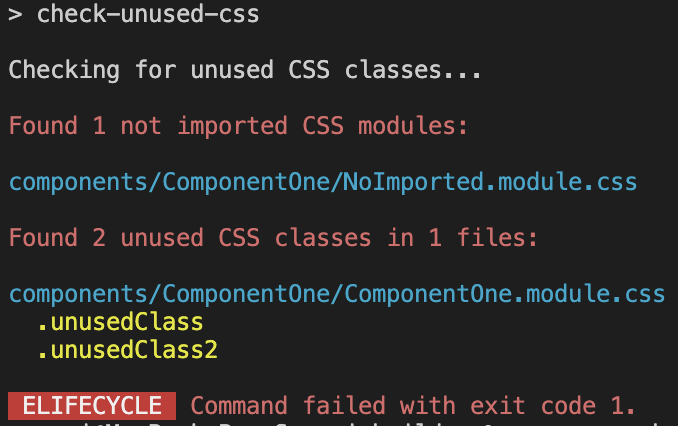

# check-unused-css

A **zero-config** tool to find unused CSS classes in your TypeScript project. Works with .module.css, .module.scss, and .module.sass.

No more dead styles in your codebase!

Fully tested - check the [tests folder](./src/__tests__/) for real-world scenarios.

## Example output



## Install

```bash
npm i --D check-unused-css
```

## Usage

Add script to package.json:

```json
{
  "scripts": {
    "check-unused-css": "check-unused-css"
  }
}
```

Run:

```bash
npm run check-unused-css
```

### Options

You can specify a custom folder path to check:

```bash
npx check-unused-css src/components
```

By default, it checks the `src` directory.


## Limitations

The tool only works when CSS classes are used directly, for example:

```tsx
import styles from './Component.module.css';

// ...
<div className={styles.yourClassName} />
```

Dynamic class access cannot be detected:

```tsx
import styles from './Component.module.css';

const dynamicClass = Math.random() * 10 >= 5 ? 'classOne' : 'classTwo';

// ...
// cannot detect usage
<div className={styles[dynamicClass]} />
```

In such cases, the tool will skip the check and mark it as passed. Avoid dynamic access and use explicit class names for clarity.

## NOTE
This tool finds CSS classes that are declared in stylesheets but unused in components - not the other way around. It won't detect TypeScript references to CSS classes that don't exist in stylesheets.

## License

MIT
