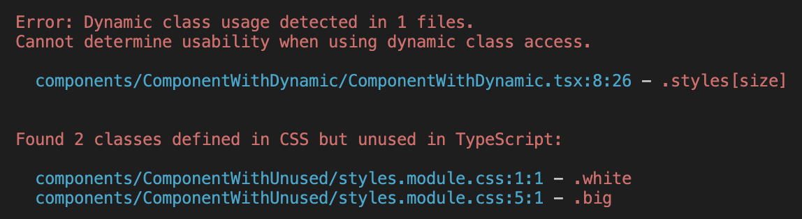

# check-unused-css

A **zero-config** tool to find unused CSS classes and non-existent class references in your TypeScript project. Works with .module.css, .module.scss, and .module.sass.

No more dead styles in your codebase!

Fully tested - check the [tests folder](./src/__tests__/) for real-world scenarios.

## Example output



## Install

```bash
npm i --D check-unused-css
```

## Usage

Add script to package.json:

```json
{
  "scripts": {
    "check-unused-css": "check-unused-css"
  }
}
```

Run:

```bash
npm run check-unused-css
```

### Options

You can specify a custom folder path to check:

```bash
npx check-unused-css src/components
```

By default, it checks the `src` directory.

#### Exclude patterns

You can exclude certain files or directories from being checked using the `--exclude` or `-e` flag. Patterns are relative to your project root:

```bash
# Exclude specific directories
npx check-unused-css --exclude "src/components/SidePanel/**"
npx check-unused-css --exclude "./src/stories/**"

# Exclude test files using glob patterns
npx check-unused-css --exclude "**/test/**"
npx check-unused-css --exclude "**/__tests__/**"

# Exclude multiple patterns
npx check-unused-css --exclude "src/components/SidePanel/**" -e "**/stories/**"

# Combine with custom path
npx check-unused-css src/components --exclude "src/components/tests/**"

# Alternative syntax with equals
npx check-unused-css --exclude="src/components/SidePanel/**"
npx check-unused-css -e="./src/stories/**"
```

Exclude patterns support both specific paths and glob syntax:

**Specific paths (from project root):**
- `src/components/SidePanel/**` - exclude specific component folder
- `./src/stories/**` - exclude stories directory
- `src/legacy/**` - exclude legacy code

**Glob patterns (universal matching):**
- `**/test/**`, `**/__tests__/**` - test directories anywhere
- `**/stories/**` - story files anywhere
- `**/*.test.{css,scss}`, `**/*.spec.*` - test files by pattern
- `**/node_modules/**` - node modules (usually not needed)

*Note: Remember to wrap patterns in quotes to prevent shell expansion*

#### Strict mode for dynamic class access

By default, the tool shows warnings for dynamic class access but doesn't fail the process. Use the `--no-dynamic` flag to treat dynamic class usage as errors:

```bash
# Fail on dynamic class access
npx check-unused-css --no-dynamic

# Combine with other options
npx check-unused-css src/components --no-dynamic --exclude "**/test/**"
```

When `--no-dynamic` is used:
- Dynamic class access (e.g., `styles[variable]`) will be treated as errors instead of warnings
- The process will exit with code 1 if any dynamic usage is detected
- Error messages will be displayed in red instead of yellow warnings

This is useful in CI/CD pipelines where you want to enforce explicit class usage.

**[Read more about why dynamic class access should be avoided](./docs/avoid-dynamic-classes.md)**

#### Ignoring files or lines with comments

You can ignore specific lines or entire files from CSS checking using special comments, similar to ESLint:

**For CSS files:**

```css
/* check-unused-css-disable */
.unusedClass { }
```

```css
.usedClass { }

/* check-unused-css-disable-next-line */
.unusedClass { }
```

**For TypeScript/TSX files:**

```tsx
// check-unused-css-disable
import styles from './Component.module.css';

export const Component = () => (
  <div className={styles.unusedClass} />
);
```

```tsx
import styles from './Component.module.css';

export const Component = () => (
  <div>
    <div className={styles.usedClass} />
    {/* check-unused-css-disable-next-line */}
    <div className={styles.unusedClass} />
  </div>
);
```

**Supported comment formats:**
- `/* check-unused-css-disable */` - ignore entire CSS file
- `/* check-unused-css-disable-next-line */` - ignore next line in CSS
- `// check-unused-css-disable` - ignore entire TS/TSX file
- `// check-unused-css-disable-next-line` - ignore next line in TS/TSX
- `{/* check-unused-css-disable-next-line */}` - ignore next line in JSX (TSX)

## TypeScript Path Aliases Support

`check-unused-css` automatically supports TypeScript path aliases defined in your `tsconfig.json`.

### Example

If you have path aliases in your TypeScript configuration:

```json
// tsconfig.json
{
  "compilerOptions": {
    "baseUrl": ".",
    "paths": {
      "@/*": ["src/*"],
      "@components/*": ["src/components/*"],
      "~/*": ["lib/*"]
    }
  }
}
```

Then imports using these aliases will be correctly resolved:

```typescript
// Component.tsx
import styles from '@/components/Button.module.css';     // ✅ Works
import styles from '@components/ui/Card.module.css';    // ✅ Works
import styles from '~/shared/theme.module.css';         // ✅ Works
```

### How it works

- Automatically finds and parses `tsconfig.json` in your project
- Supports `extends` for shared configurations
- Supports wildcard patterns (`*`)
- Falls back to regular path resolution if no aliases match
- No configuration needed - it just works!

### Supported features

- ✅ Simple aliases: `"@utils": ["src/utils"]`
- ✅ Wildcard aliases: `"@/*": ["src/*"]`
- ✅ Nested aliases: `"@components/ui/*": ["src/components/ui/*"]`
- ✅ Multiple path mappings (uses first match)
- ✅ Config inheritance via `extends`

## CI Integration

Set up automated checks for unused CSS in your pipeline.  
See **[CI integration examples](./docs/ci-integration.md)** for GitHub Actions and GitLab CI.

## Limitations

The tool only works when CSS classes are used directly, for example:

```tsx
import styles from './Component.module.css';

// ...
<div className={styles.yourClassName} />
```

Dynamic class access cannot be detected:

```tsx
import styles from './Component.module.css';

const dynamicClass = Math.random() * 10 >= 5 ? 'classOne' : 'classTwo';

// ...
// cannot detect usage
<div className={styles[dynamicClass]} />
```

In such cases, the tool will skip the check and mark it as passed. [Avoid dynamic access](./docs/avoid-dynamic-classes.md) and use explicit class names for clarity.

## FAQ

### Why not use [`typescript-plugin-css-modules`](https://www.npmjs.com/package/typescript-plugin-css-modules)?
First, it doesn't work in CI without generating `.d.ts` files.  
Second, even in IDEs it **often doesn't work reliably** due to caching, misconfigured TypeScript, or not using the workspace version.

---

### I use dynamic class access like `styles[size]` and don’t want to change that
In that case, this library is probably not a good fit for your project.  
I **[recommend](./docs/avoid-dynamic-classes.md)** not mixing concerns. Instead, you can:
- write explicit map functions to convert values to class names
- use [`class-variance-authority`](https://www.npmjs.com/package/class-variance-authority)

---

### This is too complex. Why not just use Tailwind?
If you like Tailwind - go for it!

---

### [`typed-scss-modules`](https://www.npmjs.com/package/typed-scss-modules) or [`typed-css-modules`](https://www.npmjs.com/package/typed-css-modules) solves this. Why do I need your lib?
These libs require:
- generating and committing `.d.ts` files to your repo
- developing in watch mode to keep them up to date  

`check-unused-css` works out of the box, supports `.css`, `.scss`, `.sass`, and requires zero config.

## License

MIT
