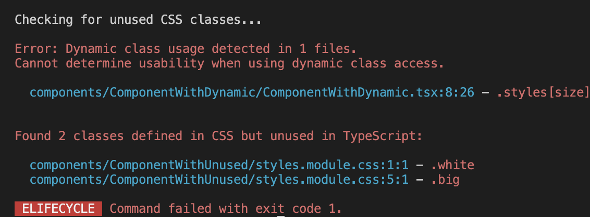

# check-unused-css

A **zero-config** tool to find unused CSS classes in your TypeScript project. Works with .module.css, .module.scss, and .module.sass.

No more dead styles in your codebase!

Fully tested - check the [tests folder](./src/__tests__/) for real-world scenarios.

## Example output



## Install

```bash
npm i --D check-unused-css
```

## Usage

Add script to package.json:

```json
{
  "scripts": {
    "check-unused-css": "check-unused-css"
  }
}
```

Run:

```bash
npm run check-unused-css
```

### Options

You can specify a custom folder path to check:

```bash
npx check-unused-css src/components
```

By default, it checks the `src` directory.

#### Exclude patterns

You can exclude certain files or directories from being checked using the `--exclude` or `-e` flag. Patterns are relative to your project root:

```bash
# Exclude specific directories
npx check-unused-css --exclude "src/components/SidePanel/**"
npx check-unused-css --exclude "./src/stories/**"

# Exclude test files using glob patterns
npx check-unused-css --exclude "**/test/**"
npx check-unused-css --exclude "**/__tests__/**"

# Exclude multiple patterns
npx check-unused-css --exclude "src/components/SidePanel/**" -e "**/stories/**"

# Combine with custom path
npx check-unused-css src/components --exclude "src/components/tests/**"

# Alternative syntax with equals
npx check-unused-css --exclude="src/components/SidePanel/**"
npx check-unused-css -e="./src/stories/**"
```

Exclude patterns support both specific paths and glob syntax:

**Specific paths (from project root):**
- `src/components/SidePanel/**` - exclude specific component folder
- `./src/stories/**` - exclude stories directory
- `src/legacy/**` - exclude legacy code

**Glob patterns (universal matching):**
- `**/test/**`, `**/__tests__/**` - test directories anywhere
- `**/stories/**` - story files anywhere
- `**/*.test.{css,scss}`, `**/*.spec.*` - test files by pattern
- `**/node_modules/**` - node modules (usually not needed)

*Note: Remember to wrap patterns in quotes to prevent shell expansion*

#### Strict mode for dynamic class access

By default, the tool shows warnings for dynamic class access but doesn't fail the process. Use the `--no-dynamic` flag to treat dynamic class usage as errors:

```bash
# Fail on dynamic class access
npx check-unused-css --no-dynamic

# Combine with other options
npx check-unused-css src/components --no-dynamic --exclude "**/test/**"
```

When `--no-dynamic` is used:
- Dynamic class access (e.g., `styles[variable]`) will be treated as errors instead of warnings
- The process will exit with code 1 if any dynamic usage is detected
- Error messages will be displayed in red instead of yellow warnings

This is useful in CI/CD pipelines where you want to enforce explicit class usage.

**[Read more about why dynamic class access should be avoided](./docs/avoid-dynamic-classes.md)**

## CI Integration

Set up automated checks for unused CSS in your pipeline.  
See **[CI integration examples](./docs/ci-integration.md)** for GitHub Actions and GitLab CI.

## Limitations

The tool only works when CSS classes are used directly, for example:

```tsx
import styles from './Component.module.css';

// ...
<div className={styles.yourClassName} />
```

Dynamic class access cannot be detected:

```tsx
import styles from './Component.module.css';

const dynamicClass = Math.random() * 10 >= 5 ? 'classOne' : 'classTwo';

// ...
// cannot detect usage
<div className={styles[dynamicClass]} />
```

In such cases, the tool will skip the check and mark it as passed. [Avoid dynamic access](./docs/avoid-dynamic-classes.md) and use explicit class names for clarity.

## NOTE
This tool finds CSS classes that are declared in stylesheets but unused in components - not the other way around. It won't detect TypeScript references to CSS classes that don't exist in stylesheets.

## License

MIT
